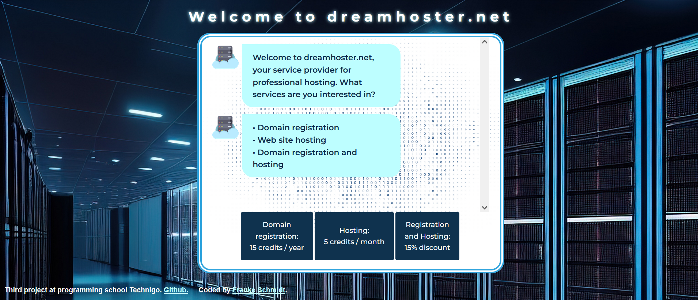

# Project Name
Technigo-project3-project-chatbot
Build a chatbot.
# Technigo web development bootcamp august 2023 - jan 2024: project 2

This is a solution to the third project for the students:
This week's project is all about building a functional chatbot interface using JavaScript, HTML, and CSS. You'll create a captivating chatbot that can interact with users, ask questions, display messages, and respond with precision. 

**What you need to do**

Fullfill the requirements described in step 1-5.

## Table of contents

  - [Overview](#overview)
  - [Screenshot](#screenshot)
  - [Links](#links)
  - [My process](#my-process)
  - [Built with](#built-with)
  - [What I learned](#what-i-learned)
  - [Continued development](#continued-development)
  - [Useful resources](#useful-resources)
  - [Author](#author)

## Overview

3rd challenge for front end developer students.

### Screenshot

.

### Links

- Solution URL: [https://github.com/colognia/Technigo-project3-project-chatbot]
- Live Site URL: [https://colognia.github.io/Technigo-project3-project-chatbot/]

## My process

- creating a basic flow on paper
- coding one step after the other
- testing every part in browser and in case of problems with console.log and with a validator
- modifying some html and css
- consulting my own notes regarding usage of comandos and other resources

### Built with

- vanilla JS
- Semantic HTML5 markup
- CSS custom properties
- editor: visual studio code

### What I learned 

How to manipulate the DOM with vanilla JS, catching and processing events, how to manipulate the time of execution of functions, how to conduct the flow of executions.

### Continued development

Writing shorter and more efficient code, creating more reusable code snippets.

### Useful resources

stackoverflow, W3schools, pythontutor.com for JS as validator

## Author

- Linkedin - (https://www.linkedin.com/in/frauke-s-395242201/)

